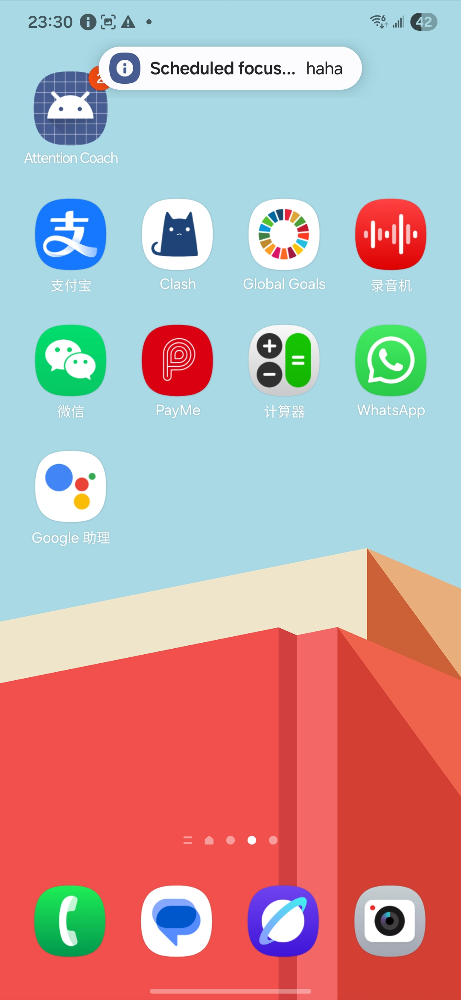

# Plan: Persistent Start-Time Reminders

## Goal

Improve scheduled task reminders so they are noticeable, repeat when ignored, and route the user directly to the related task.

Reference image:



## Feasibility

This is feasible, but Android does not guarantee exact heads-up notification dimensions or exact visible duration. The implementation can strongly influence behavior with high-importance notifications, alarm scheduling, repeat notifications, and full-screen intent for screen-off cases, but final presentation depends on OS and device settings.

## Proposed Behavior

- At task start time, show a high-importance reminder notification.
- Notification click opens the app directly to that task's Plan page.
- If the user clicks the notification, do not remind again for that task and start time.
- If the user ignores the notification, repeat after the configured notification interval.
- If the task start time changes, reminders become active again for the new start time.
- Reminder should still be deliverable when the screen is off, subject to exact alarm and notification permissions.

## State Required

Add reminder acknowledgement state keyed by task and schedule:

```kotlin
data class ReminderKey(
    val taskId: Long,
    val startEpochMillis: Long
)
```

Store acknowledged keys in a small persistent settings store, such as `SharedPreferences` or DataStore. Because `TaskReminderReceiver` can run when the app process is not active, acknowledgement state should not be memory-only.

## Notification Strategy

Use:

- `NotificationChannel` with `IMPORTANCE_HIGH`.
- `AlarmManager.setExactAndAllowWhileIdle` for the first reminder.
- A second alarm for retry if not acknowledged.
- `PendingIntent` with action such as `ACTION_TASK_REMINDER_OPEN`.
- `taskId` and reminder key extras.

Optional later improvement:

- `USE_FULL_SCREEN_INTENT` and `setFullScreenIntent()` for screen-off or lock-screen reminder behavior. This should be handled carefully because Android restricts full-screen notification usage.

## Implementation Notes

Files to inspect and likely edit:

- `app/src/main/AndroidManifest.xml`
- `app/src/main/java/com/example/attentioncoach/MainActivity.kt`
- `app/src/main/java/com/example/attentioncoach/notifications/TaskReminderReceiver.kt`
- `app/src/main/java/com/example/attentioncoach/notifications/TaskReminderScheduler.kt`
- `app/src/main/java/com/example/attentioncoach/notifications/ReminderSettingsStore.kt` or similar new file
- `app/src/main/java/com/example/attentioncoach/ui/AppShell.kt`
- `app/src/main/java/com/example/attentioncoach/ui/SettingsScreen.kt`

## Routing

On notification click:

1. Mark the reminder key as acknowledged.
2. Open MainActivity.
3. Select the task date.
4. Open the task detail Plan page.

This should not start the focus timer automatically.

## Tests

Add or update tests for:

- Reminder key changes when start time changes.
- Acknowledged reminder does not schedule repeat.
- Ignored reminder schedules repeat using the configured interval.
- Notification click route resolves task id and date.

## Commit

Suggested commit:

`feat: repeat scheduled task reminders`

Before commit:

```powershell
.\gradlew.bat testDebugUnitTest assembleDebug
```

