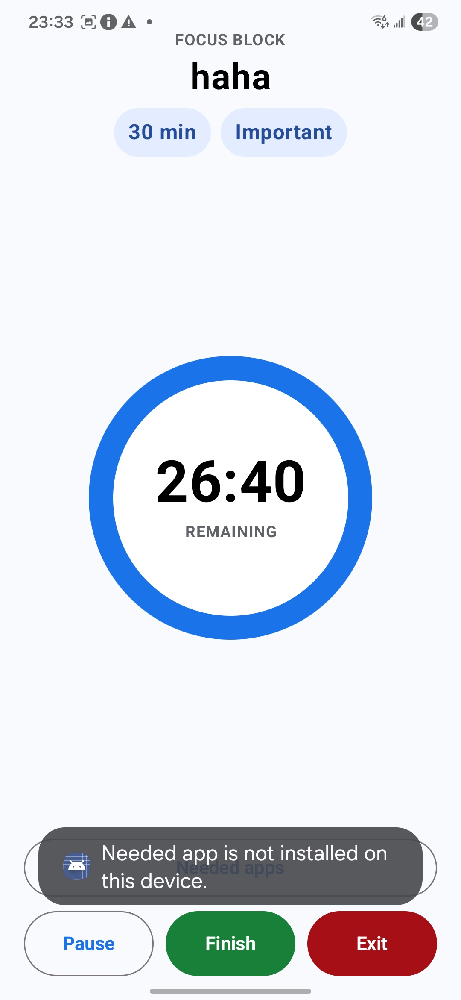

# Plan: Soft Lock, Needed Apps, and Settings

## Goal

Strengthen the focus-mode re-entry logic and make needed apps configurable from Settings.

References:




## Current Findings

The current focus monitor already has a foreground service and UsageStats polling. It checks the foreground package every few seconds and can send re-entry notifications.

Current limitations:

- Needed apps are hardcoded in the focus screen.
- Settings cannot add or remove needed apps.
- The monitor currently focuses on known leisure packages rather than every non-whitelisted app.
- Chrome launch can fail if the installed package is not exactly `com.android.chrome`, if the app is disabled, or if package visibility prevents reliable lookup.

## Proposed Behavior

During an active focus block:

1. The user can use Attention Coach.
2. The user can open apps in the Needed apps whitelist.
3. If the user leaves to any non-whitelisted app, the app sends a repeating re-entry notification.
4. Re-entry notification repeats using the interval configured in Settings.
5. If the user taps the notification, the app returns to the focus timer and pauses re-entry reminders.
6. If the user leaves again, reminders resume.

## Settings Redesign

Keep Settings focused on two sections only:

1. Needed apps
   - Show current whitelist.
   - Add installed launchable apps.
   - Remove existing needed apps.

2. Notification interval
   - Default: 30 seconds.
   - Suggested options: 30 seconds, 1 minute, 2 minutes, 5 minutes.

## Needed App Launch

Improve launch logic:

- Store needed apps as package names plus display labels.
- Discover launchable installed apps with `PackageManager.queryIntentActivities()`.
- Add manifest `<queries>` entries or broad launcher intent queries as needed for Android package visibility.
- If a configured app is unavailable, show it as unavailable in Settings and avoid showing it as a working needed app in focus mode.
- For Chrome specifically, support the installed package discovered on the device rather than assuming `com.android.chrome`.

## Focus Monitor Policy

Change soft-lock policy from:

```text
notify only for known leisure apps
```

to:

```text
notify whenever foreground app is not Attention Coach and not in Needed apps
```

This matches the requested soft-lock behavior.

## Implementation Notes

Files to inspect and likely edit:

- `app/src/main/AndroidManifest.xml`
- `app/src/main/java/com/example/attentioncoach/focus/FocusMonitorService.kt`
- `app/src/main/java/com/example/attentioncoach/focus/FocusMonitorCadence.kt`
- `app/src/main/java/com/example/attentioncoach/focus/SoftLockPolicy.kt`
- `app/src/main/java/com/example/attentioncoach/notifications/ReentryNotifier.kt`
- `app/src/main/java/com/example/attentioncoach/ui/FocusScreens.kt`
- `app/src/main/java/com/example/attentioncoach/ui/TopLevelInfoScreens.kt`
- `app/src/main/java/com/example/attentioncoach/settings/AppSettingsStore.kt` or similar new file

## Tests

Add or update tests for:

- Non-whitelisted foreground app triggers re-entry.
- Whitelisted needed app does not trigger re-entry.
- Attention Coach package does not trigger re-entry.
- Notification interval setting is passed to the monitor.
- Needed app launch list only includes launchable apps.

## Commit

Suggested commits:

1. `feat: add configurable needed apps`
2. `feat: repeat focus reentry reminders`
3. `fix: launch installed needed apps reliably`

Before each commit:

```powershell
.\gradlew.bat testDebugUnitTest assembleDebug
```

